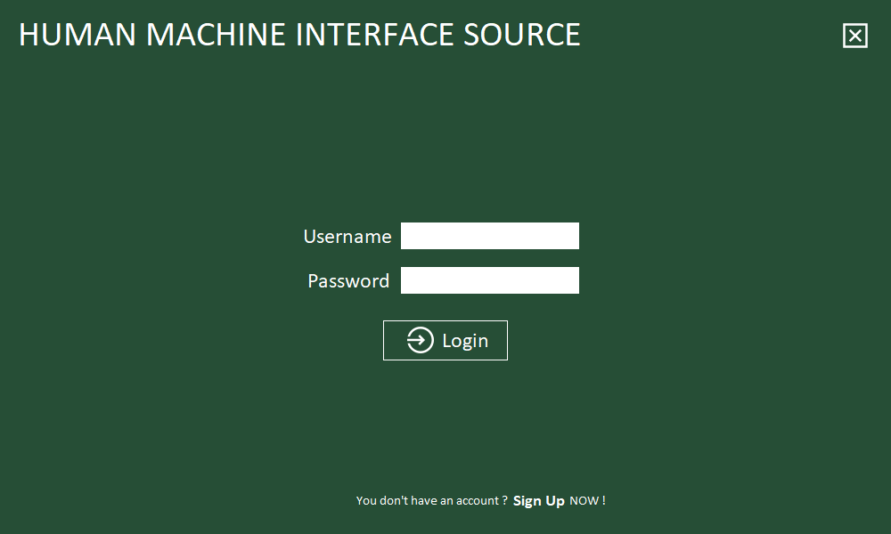
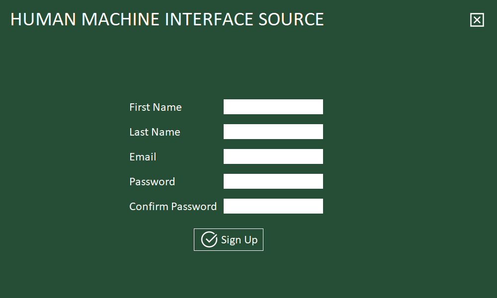
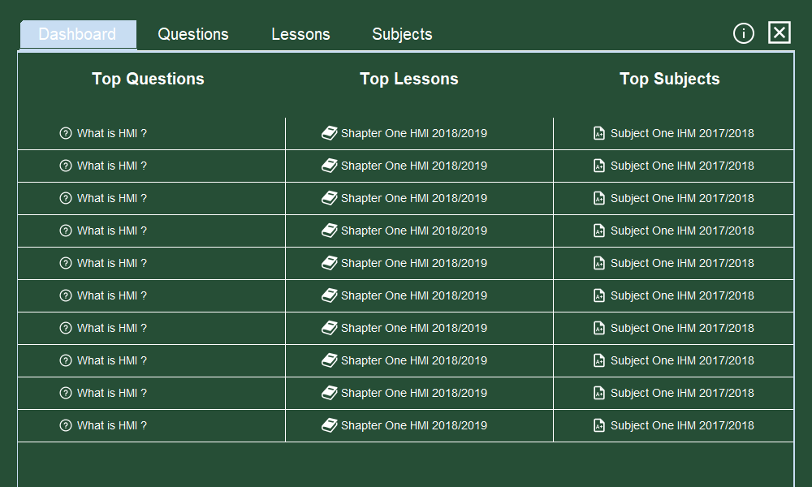
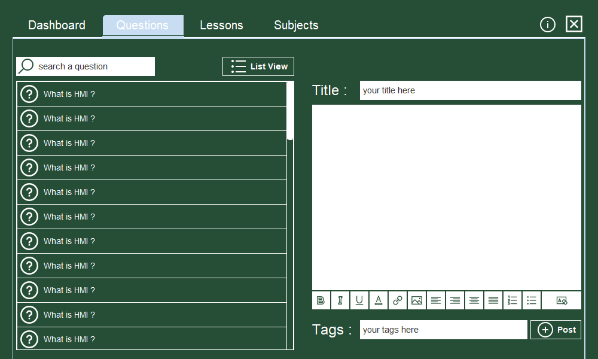
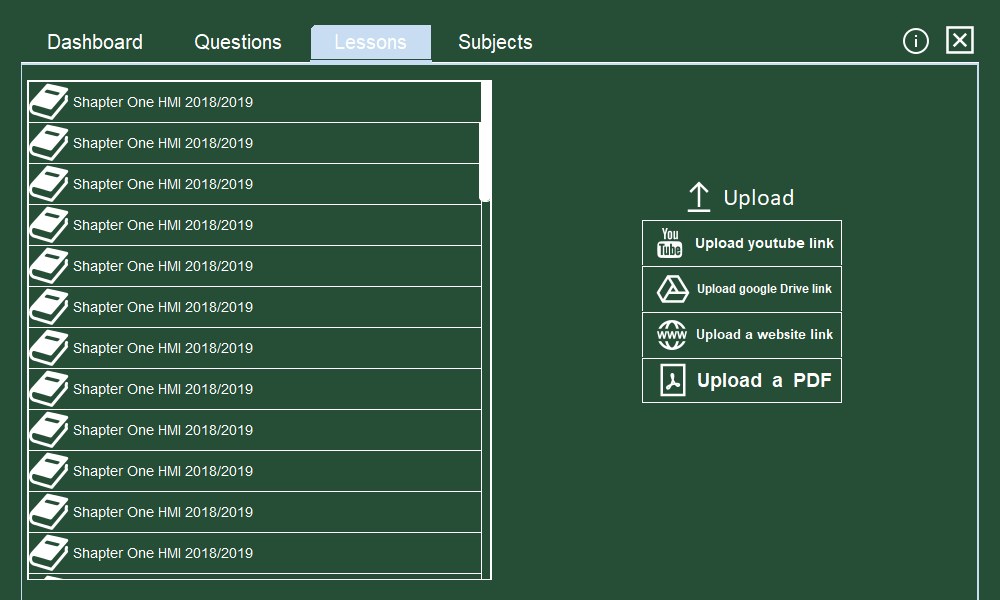
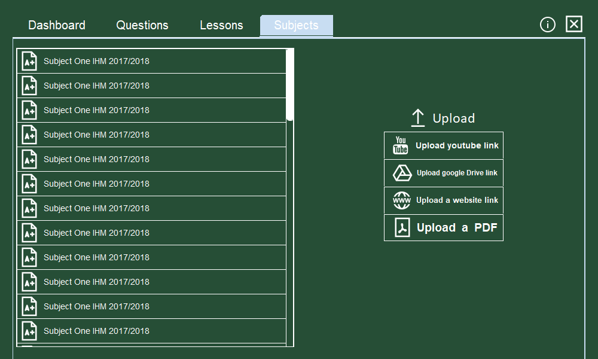
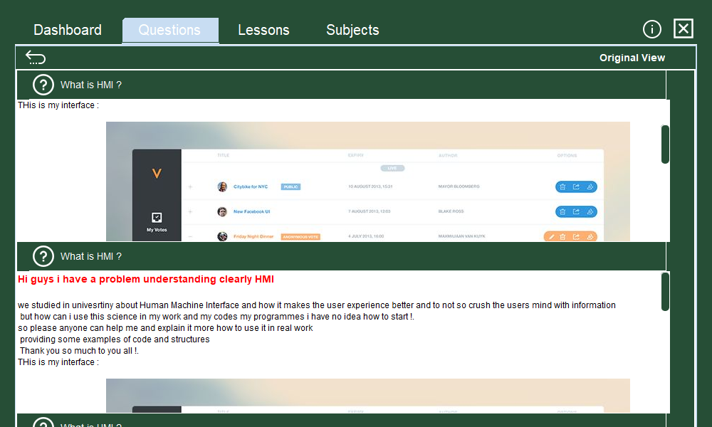
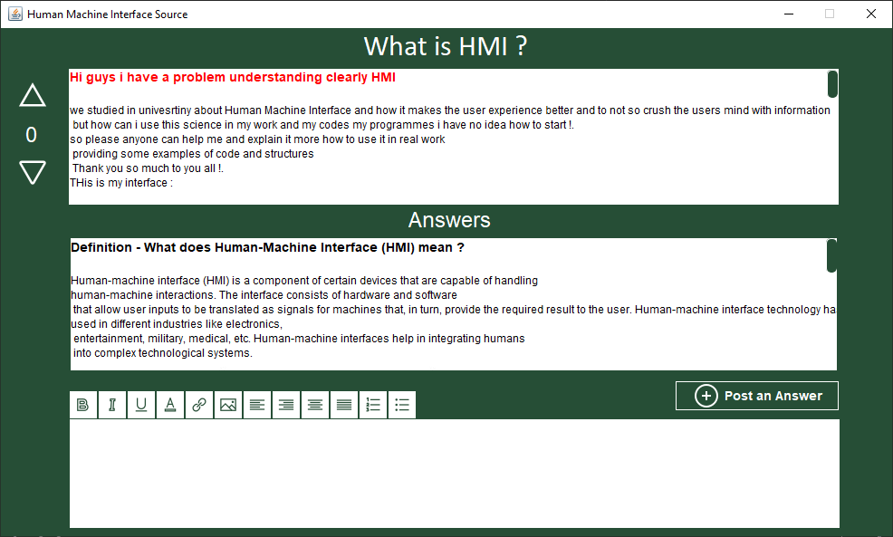
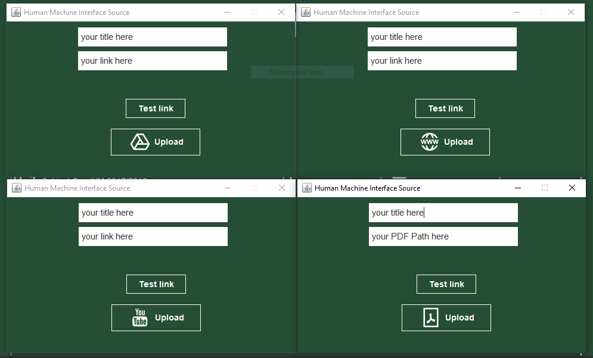

# Forum Desktop App

 
  - **HERE IS ALL USER INTERFACES AND WHAT NEEDS TO BE IMPLEMENTED  :**
  - In the Login interface and SignUp is working fine the onnly thing is to integrate the database and add some code in it to work 

  - Dashboard needs to be dynamic all that questions and lessons and subjects needs to be dynamic, it will update 10 most rated in the dashboard  

  - Question Interface : 
  - Search bar is not working 
  - The add question not fully working the customize words buttons 
  - The post Button needs to be implemented and add the question dynamicly to the list view 

  - Same for Lessons and subjects , needs to implement the code that allows inserting in the list view dynamicly
  - add the rate icons to have the ability to show it in the dashboard 

  - this another view for questions interface that shows the quesion and the answer at the same time ... here what needs to be implemented is adding multiple answers to a question

  - Here the answer interface it will show up the question and all tha answers ... here you can add an answer using post answer button soo this button and the customize buttons needs to be completed 
  - Tha rate icon needs some polishment  
  - add rate icons to the answers 

  - uploading is working just needs to add it to the the desired container to show it up in the list view  

- i'll update the app time to time ... i appreciate your contribution 